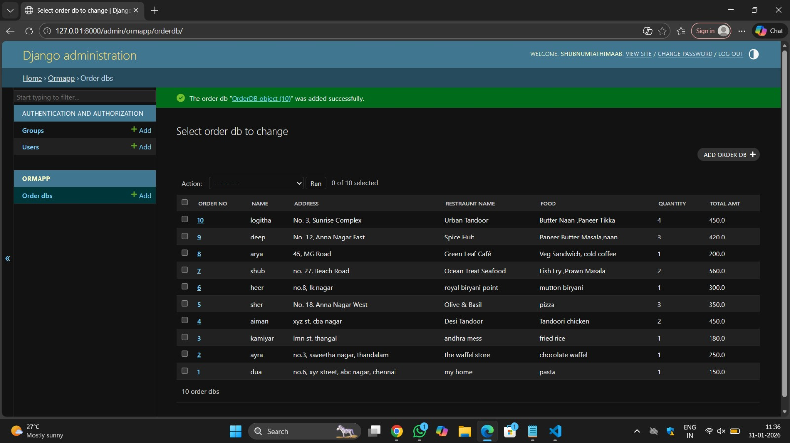

# Ex01 Django ORM Web Application
## Date: 31/01/2026

## AIM
To develop a Django Application to store and retrieve data from an Online Food Delivery Database platform like Zomato or Swiggy using Object Relational Mapping(ORM).

## DESIGN STEPS

### STEP 1:
Clone the problem from GitHub

### STEP 2:
Create a new app in Django project

### STEP 3:
Enter the code for admin.py and models.py

### STEP 4:
Detect changes and create migration files that describe how to modify the database schema

### STEP 5:
Execute the migration files and update the database schema to match your Django models

### STEP 6:
Create a superuser with full access rights to all models and data through the admin interface.

### STEP 7:
Apply the migration files of the created app to the database

### STEP 8:
Execute Django admin using localhost and create details for 10 entries

## PROGRAM
```
models.py
from django.db import models
from django.contrib import admin

class OrderDB(models.Model):
    Order_No=models.IntegerField(primary_key=True);
    Name=models.CharField(max_length=10);
    Address=models.CharField(max_length=100);
    Restraunt_Name=models.CharField(max_length=25);
    Food=models.CharField(max_length=25);
    Quantity=models.IntegerField();
    Total_amt=models.FloatField();

class OrderDBAdmin(admin.ModelAdmin):
    list_display=['Order_No','Name', 'Address','Restraunt_Name','Food','Quantity','Total_amt']

    admin.py
    from django.contrib import admin
from .models import OrderDB,OrderDBAdmin
admin.site.register(OrderDB,OrderDBAdmin)
```


## OUTPUT



## RESULT
Thus the program for creating online food delivery website database using ORM has been executed successfully.
